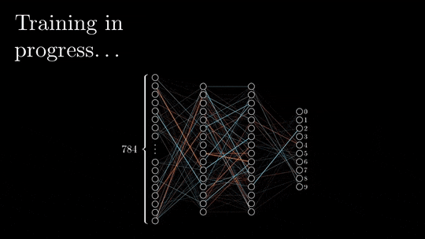

# Ciência de Dados

[![CC BY-SA 4.0][cc-by-sa-shield]][cc-by-sa]

Disciplina dos Cursos de *Ciências da Computação* e afins da [**UNINOVE**](https://www.uninove.br).



## Conteúdo

* **Python**
* **Álgebra Linear com `NumPy`**
* **Análise de Dados com `pandas`**
* **Visualização de Dados com `pandas`, `matplotlib` e `seaborn`**
* **Machine Learning com `Scikit-Learn`**
* **Redes Neurais com `TensorFlow`, `Keras` e PyTorch**

## Professor

[Prof. Dr. José Eduardo Storopoli](https://storopoli.io) - [Currículo *Lattes*](http://lattes.cnpq.br/2281909649311607) - [ORCID](https://orcid.org/0000-0002-0559-5176)

[josees@uni9.pro.br](mailto:josees@uni9.pro.br)

## Como usar esse conteúdo?

Este conteúdo possui *licença livre para uso* (CC BY-SA). Caso queira utilizar o conteúdo para um curso ou estudos, por favor colabore nesse repositório quaisquer aprimorações que foram realizadas.

Para configurar um ambiente local:

1. Clone o repositório do GitHub: `git clone https://github.com/storopoli/ciencia-de-dados.git`
2. Acesse o diretório: `cd ciencia-de-dados`
3. Instale as bibliotecas necessárias: `pip install -r .binder/requirements.txt` ou `conda env create -f .binder/environment.yml`

* **[Notebooks](https://github.com/storopoli/ciencia-de-dados/tree/master/notebooks)**: Jupyter Notebooks das aulas

## Notebooks

* **Aula Especial** - Curso Rápido de Python para Programadores [](https://mybinder.org/v2/gh/storopoli/ciencia-de-dados/master?filepath=notebooks%2FAula_Especial_Python.ipynb) [](https://colab.research.google.com/github/storopoli/ciencia-de-dados/blob/master/notebooks/Aula_Especial_Python.ipynb)
* **Aula 0** - Jupyter Notebook [](https://mybinder.org/v2/gh/storopoli/ciencia-de-dados/master?filepath=notebooks%2FAula_0_Jupyter.ipynb) [](https://colab.research.google.com/github/storopoli/ciencia-de-dados/blob/master/notebooks/Aula_0_Jupyter.ipynb)
* **Aula 1** - Operadores aritméticos, relacionais e lógicos [](https://mybinder.org/v2/gh/storopoli/ciencia-de-dados/master?filepath=notebooks%2FAula_1_Operadores_Aritmeticos_Relacionais_e_Logicos.ipynb) [](https://colab.research.google.com/github/storopoli/ciencia-de-dados/blob/master/notebooks/Aula_1_Operadores_Aritmeticos_Relacionais_e_Logicos.ipynb)
* **Aula 2** - Desvio Condicional (`IF`) [](https://mybinder.org/v2/gh/storopoli/ciencia-de-dados/master?filepath=notebooks%2FAula_2_Desvio_Condicional_IF.ipynb) [](https://colab.research.google.com/github/storopoli/ciencia-de-dados/blob/master/notebooks/Aula_2_Desvio_Condicional_IF.ipynb)
* **Aula 3** - Estruturas de Repetição (`FOR` e `WHILE`) [](https://mybinder.org/v2/gh/storopoli/ciencia-de-dados/master?filepath=notebooks%2FAula_3_Estruturas_de_Repeticao.ipynb) [](https://colab.research.google.com/github/storopoli/ciencia-de-dados/blob/master/notebooks/Aula_3_Estruturas_de_Repeticao.ipynb)
* **Aula 4** - Estruturas de Dados (`list` e `dict`) [](https://mybinder.org/v2/gh/storopoli/ciencia-de-dados/master?filepath=notebooks%2FAula_4_Estrutura_de_Dados.ipynb) [](https://colab.research.google.com/github/storopoli/ciencia-de-dados/blob/master/notebooks/Aula_4_Estrutura_de_Dados.ipynb)
* **Aula 5** - Funções e métodos [](https://mybinder.org/v2/gh/storopoli/ciencia-de-dados/master?filepath=notebooks%2FAula_5_Metodos_e_Funcoes.ipynb) [](https://colab.research.google.com/github/storopoli/ciencia-de-dados/blob/master/notebooks/Aula_5_Metodos_e_Funcoes.ipynb)
* **Aula 6** - `NumPy` e Algebra Linear [](https://mybinder.org/v2/gh/storopoli/ciencia-de-dados/master?filepath=notebooks%2FAula_6_Numpy_Algebra_Linear.ipynb) [](https://colab.research.google.com/github/storopoli/ciencia-de-dados/blob/master/notebooks/Aula_6_Numpy_Algebra_Linear.ipynb)
* **Aula 7** - `pandas` [](https://mybinder.org/v2/gh/storopoli/ciencia-de-dados/master?filepath=notebooks%2FAula_7_pandas.ipynb) [](https://colab.research.google.com/github/storopoli/ciencia-de-dados/blob/master/notebooks/Aula_7_pandas.ipynb)
* **Aula 8** - `pandas` estatística [](https://mybinder.org/v2/gh/storopoli/ciencia-de-dados/master?filepath=notebooks%2FAula_8_pandas_estatistica.ipynb) [](https://colab.research.google.com/github/storopoli/ciencia-de-dados/blob/master/notebooks/Aula_8_pandas_estatistica.ipynb)
* **Aula 9** - Gráficos com `matplotlib` e `pandas` [](https://mybinder.org/v2/gh/storopoli/ciencia-de-dados/master?filepath=notebooks%2FAula_9_graficos.ipynb) [](https://colab.research.google.com/github/storopoli/ciencia-de-dados/blob/master/notebooks/Aula_9_graficos.ipynb)
* **Aula 10** - Machine Learning com `Scikit-Learn` [](https://mybinder.org/v2/gh/storopoli/ciencia-de-dados/master?filepath=notebooks%2FAula_10_Machine_Learning.ipynb) [](https://colab.research.google.com/github/storopoli/ciencia-de-dados/blob/master/notebooks/Aula_10_Machine_Learning.ipynb)
* **Aula 11** - Regressão Linear com `Scikit-Learn` [](https://mybinder.org/v2/gh/storopoli/ciencia-de-dados/master?filepath=notebooks%2FAula_11_Regressao_Linear.ipynb) [](https://colab.research.google.com/github/storopoli/ciencia-de-dados/blob/master/notebooks/Aula_11_Regressao_Linear.ipynb)
* **Aula 12** - Regressão Logística com `Scikit-Learn` [](https://mybinder.org/v2/gh/storopoli/ciencia-de-dados/master?filepath=notebooks%2FAula_12_Regressao_Logistica.ipynb) [](https://colab.research.google.com/github/storopoli/ciencia-de-dados/blob/master/notebooks/Aula_12_Regressao_Logistica.ipynb)
* **Aula 13** - Support Vector Machines com `Scikit-Learn` [](https://mybinder.org/v2/gh/storopoli/ciencia-de-dados/master?filepath=notebooks%2FAula_13_Support_Vector_Machines.ipynb) [](https://colab.research.google.com/github/storopoli/ciencia-de-dados/blob/master/notebooks/Aula_13_Support_Vector_Machines.ipynb)
* **Aula 14** - Árvores de Decisão com `Scikit-Learn` [](https://mybinder.org/v2/gh/storopoli/ciencia-de-dados/master?filepath=notebooks%2FAula_14_Arvores_de_Decisao.ipynb) [](https://colab.research.google.com/github/storopoli/ciencia-de-dados/blob/master/notebooks/Aula_14_Arvores_de_Decisao.ipynb)
* **Aula 15** - Florestas Aleatórias com `Scikit-Learn` [](https://mybinder.org/v2/gh/storopoli/ciencia-de-dados/master?filepath=notebooks%2FAula_15_Florestas_Aleatorias.ipynb) [](https://colab.research.google.com/github/storopoli/ciencia-de-dados/blob/master/notebooks/Aula_15_Florestas_Aleatorias.ipynb)
* **Aula 16** - Análise de Componentes Principais (PCA) com `Scikit-Learn` [](https://mybinder.org/v2/gh/storopoli/ciencia-de-dados/master?filepath=notebooks%2FAula_16_Analise_de_Componentes_Principais.ipynb) [](https://colab.research.google.com/github/storopoli/ciencia-de-dados/blob/master/notebooks/Aula_16_Analise_de_Componentes_Principais.ipynb)
* **Aula 17** - Análise de Agrupamentos (Clusterização) com `Scikit-Learn` [](https://mybinder.org/v2/gh/storopoli/ciencia-de-dados/master?filepath=notebooks%2FAula_17_Clusterizacao.ipynb) [](https://colab.research.google.com/github/storopoli/ciencia-de-dados/blob/master/notebooks/Aula_17_Clusterizacao.ipynb)
* **Aula 18a** - Redes Neurais com `TensorFlow` e `Keras` [](https://mybinder.org/v2/gh/storopoli/ciencia-de-dados/master?filepath=notebooks%2FAula_18_a_Redes_Neurais_com_TensorFlow.ipynb) [](https://colab.research.google.com/github/storopoli/ciencia-de-dados/blob/master/notebooks/Aula_18_a_Redes_Neurais_com_TensorFlow.ipynb)
* **Aula 18b** - Redes Neurais com `PyTorch` [](https://mybinder.org/v2/gh/storopoli/ciencia-de-dados/master?filepath=notebooks%2FAula_18_b_Redes_Neurais_com_PyTorch.ipynb) [](https://colab.research.google.com/github/storopoli/ciencia-de-dados/blob/master/notebooks/Aula_18_b_Redes_Neurais_com_PyTorch.ipynb)

## Como citar esse conteúdo

Para citar o conteúdo use:

```
Storopoli (2020, March 2). Ciência de Dados com Python: pandas, matplotlib, scikit-learn e tensorflow: Ciência de Dados. Disponível em: https://storopoli.io/ciencia-de-dados
```

Ou em formato BibTeX para LaTeX:

```
@misc{storopoli2020cienciadedados,
  author = {Storopoli, Jose},
  title = {Ciência de Dados com Python: pandas, matplotlib, scikit-learn e tensorflow: Ciência de Dados},
  url = {https://storopoli.io/ciencia-de-dados},
  year = {2020}
}
```

## Licença

Este obra está licenciado com uma Licença
[Creative Commons Atribuição-CompartilhaIgual 4.0 Internacional][cc-by-sa].

[![CC BY-SA 4.0][cc-by-sa-image]][cc-by-sa]

[cc-by-sa]: http://creativecommons.org/licenses/by-sa/4.0/
[cc-by-sa-image]: https://licensebuttons.net/l/by-sa/4.0/88x31.png
[cc-by-sa-shield]: https://img.shields.io/badge/License-CC%20BY--SA%204.0-lightgrey.svg
